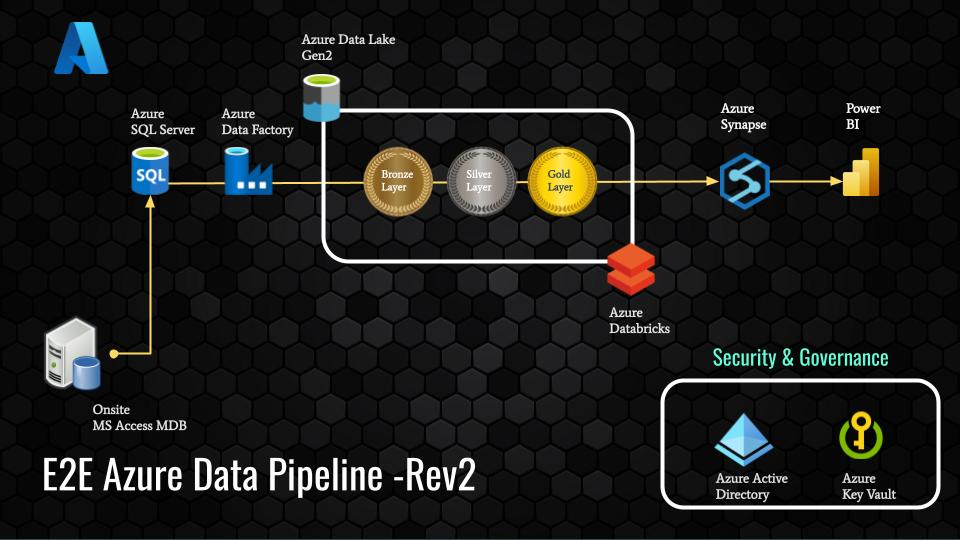

# E2E-Azure-Pipeline
Databricks ETL Pipeline for retrieving and processing NI TestStand test results, featuring a well-documented notebook for ETL operations, Data Lake for storage, Spark SQL for transformations, and Power BI as the final visualization of factory metrics.
